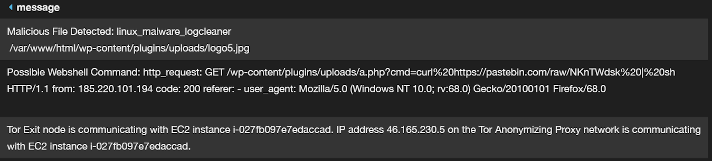

# Cado Response Integration with Amazon GuardDuty using AWS Lambda #
This repository contains a simple example where:
- An alert is triggered by GuardDuty
- The alert is then picked up in EventBridge
- EventBridge then calls an AWS Lambda function which...
- Triggers Cado Response to perform a full capture and investigation of the compromised EC2 instance

### How to Deploy ###

If you want to try this yourself, you can deploy a free trial of Cado Response [here](https://www.cadosecurity.com/free-investigation/).

In Guard Duty you can increase how often “repeat alarms” are sent - this is useful for testing (GuardDuty > Settings).

To trigger the Guard Duty alarms either click “Generate Sample Findings”  (GuardDuty > Settings) or run our tool at <https://github.com/cado-security/CloudAndContainerCompromiseSimulator>

Create a Lambda function that is triggered by GuardDuty in EventBridge. It’s just a couple of clicks to hook it up - no need to mess around with SNS or WebHooks!

Now we need to create a Lambda function which will get the AWS Instance ID from the event and call the Cado Response API with it.

The code is in this repository (lambda_function.py) - if you run as Python3.7 in Lambda you can simple copy and paste this code. If you run with the latest Python3.9 - the requests library isn't built in anymore so you will need to download this repository as a zip then upload it to AWS Lambda. For ECS Fargate you’ll need the task name, more on that to come.

You will need to set environment variables such as the hostname of the Cado Response installation and API key:

You can test the Lambda function is working correctly by running the test event (test_event.json in this repository):

Which will result in output such as below. The EC2 import will fail as the instance will not exist in your environmet. You can also capture a real event from your own environment for testing:

In total this should take about 15 minutes to set up.
And what you get from that is… about 10 minutes after the GuardDuty is triggered - Cado Response goes and collects a full copy of the system before it’s destroyed and hunts through it for logs, malware etc:

You can also enable exporting the GuardDuty logs and the Cado Response output into an S3 bucket. You can then import the Cado Response output into a SIEM such as Splunk or a Ticketing system such as Jira. You can push out thousands of events for a compromised system if you want them all.

What that means is you now get in your SIEM the original Guard Duty alert from AWS detections on the API & Network side of the house - sitting side by side with the on disk detections, logs, even full file strings contents of files if you want it.
You can read more on this [here](https://www.cadosecurity.com/how-to-add-forensics-to-your-siem-and-start-automating-investigations/). 

### Learn More ###

If you want to try this yourself, you can deploy a free trial of Cado Response [here](https://www.cadosecurity.com/free-investigation/).
